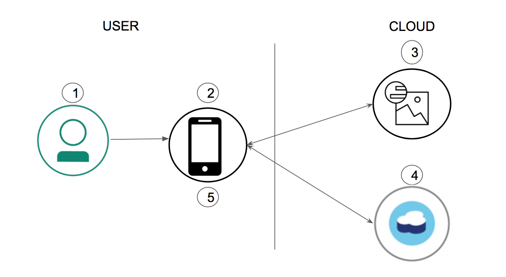

# Augmented Reality based Résumé with Visual Recognition
In this code pattern, we will create augmented reality based résumé with Visual recognition. The iOS app recognizes the face and presents you with the AR view that contains details of the person in the camera view. The app utilizes IBM Visual Recognition to classify the image and uses that classification to get details about the person that is stored in IBM Cloudant


# Flow



1. User initiates the ar app.
2. App opens up the camera view to detect the face, and crops it.
3. Classify cropped face using IBM Visual Recognition
4. Get details from IBM Cloudant using the classification
5. Overlay the data in front of the user in the mobile camera view


# Included Components
1. Swift mobile app
    1. Face Recognition using Vision API
    1. ARKit : An iOS augmented reality platform        
2. IBM Visual Recognition: An IBM service to analyze the visual content of images or video frames to understand what is happening in a scene
3. IBM Cloudant DB: A highly scalable and performant JSON database service


# Steps
1. Clone the project using `git clone https://github.com/IBM/ar-resume-with-visual-recognition`
2. Login to IBM Cloud account, create a [IBM Visual Recognition](https://console.bluemix.net/catalog/services/visual-recognition) service and save the credentials.
3. Using the IBM Visual Recognition tool, create a classifier. A classifier will train the visual recognition so that the    Visual Recognition API will recognizse different images of the same person. Use at least ten images of your head shot and also create a negative data set by using a headshots that are not your own.
4. Create an [IBM Cloudant NoSQL database](https://console.bluemix.net/catalog/services/cloudant-nosql-db) and save the credentials. Create a JSON with the `classificationId` as one of the key-value pair. This ID will be used to retrieve details about the classified person.
5. Update the [`credentials.swift`](ResumeAR/Credentials.swift) file with the Cloudant and Watson Visual Recognition credentials.
6. Open the project using `Xcode`.
7. Run `pod install` to install the dependencies.
8. Run `carthage update --platform iOS` to install the Watson related dependencies.
9. Once the previous steps are complete run the application using Xcode by going the the `Build` and `Deploy` menu options.

# Test

To test locally you can do the following: 

1. Train IBM visual recognition with your head shot images. Please use at least 10 images of your head shot and use a negative training by using a different head shot which is not you.

2. Update the Cloudant database using the classification id from the training to store your information. The JSON will be in the format:

```
{  
  "classificationId": "<classification id from vr training>",
  "fullname": "<name of the person in image>",
  "linkedin": "<linked in user id of the person in image>",
  "twitter": "<twitter username of the person in image>",
  "facebook": "<facebook username of the person in image>",
  "phone": "<phone number of the person in image>",
  "location": "<location (city,state) of the person in image>"
}
```

To add the document you can use the following POST command:

```
curl https://$ACCOUNT.cloudant.com/$DATABASE \
    -X POST \
    -H "Content-Type: application/json" \
    -d "$JSON"
```

where `$ACCOUNT` is your bluemix account id, `$DATABASE` is the database you created in IBM Cloudant and `$JSON` is above json.

3. Run the app and point the camera view to your image.

# Learn more

* **Artificial Intelligence Code Patterns**: Enjoyed this Code Pattern? Check out our other [AI Code Patterns](https://developer.ibm.com/code/technologies/artificial-intelligence/).
* **AI and Data Code Pattern Playlist**: Bookmark our [playlist](https://www.youtube.com/playlist?list=PLzUbsvIyrNfknNewObx5N7uGZ5FKH0Fde) with all of our Code Pattern videos
* **With Watson**: Want to take your Watson app to the next level? Looking to utilize Watson Brand assets? [Join the With Watson program](https://www.ibm.com/watson/with-watson/) to leverage exclusive brand, marketing, and tech resources to amplify and accelerate your Watson embedded commercial solution.


# Links
* [ARKit](https://developer.apple.com/arkit)
* [Watson Swift SDK](https://github.com/watson-developer-cloud/swift-sdk)
* [IBM Visual Recognition](https://www.ibm.com/watson/services/visual-recognition-4)
* [IBM Cloudant](https://www.ibm.com/cloud/cloudant) 

# License

[Apache 2.0](LICENSE)
