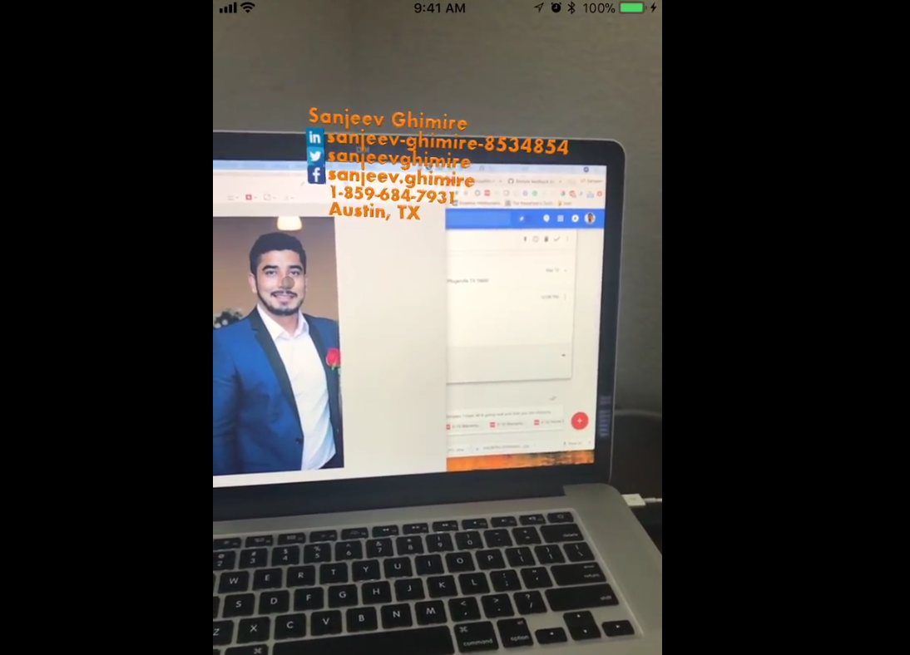

# Use Watson Visual Recognition to Create Augmented Reality based Résumé

The easiest way to find and connect to people around the world is through social media apps like Facebook, Twitter and LinkedIn. These, however, only provide text based search capabilities. However, with the recently announced release of the iOS ARKit toolkit, search is now possible using facial recognition. Combining iOS face recognition using Vision API, classification using IBM Visual Recognition, and person identification using classified image and data, one can build an app to search faces and identify them. One of the use cases is to build a Augmented Reality based résumé using visual recognition.

The main purpose of this code pattern is to demonstrate how to identify a person and his details using Augmented Reality and Visual Recognition. In this code pattern, we will create augmented reality based résumés with Visual Recognition. The iOS app recognizes the face and presents you with the AR view that displays a résumé of the person in the camera view. The app utilizes IBM Visual Recognition to classify the image and uses that classification to get details about the person from data stored in an IBM Cloudant NoSQL database.

# Flow


1. User initiates the ar app.
2. App opens up the camera view to detect the face, and crops it.
3. Classify cropped face using IBM Visual Recognition
4. Get details from IBM Cloudant using the classification
5. Overlay the data in front of the user in the mobile camera view

# Included Components
* [ARKit](https://developer.apple.com/arkit/): ARKit is an augmented reality framework for iOS applications.
* [Watson Visual Recognition](https://www.ibm.com/watson/developercloud/visual-recognition.html): Visual Recognition understands the contents of images - visual concepts tag the image, find human faces, approximate age and gender, and find similar images in a collection.
* [Cloudant NoSQL DB](https://console.ng.bluemix.net/catalog/services/cloudant-nosql-db): A fully managed data layer designed for modern web and mobile applications that leverages a flexible JSON schema.

# Technologies
* [Artificial Intelligence](https://medium.com/ibm-data-science-experience): Artificial intelligence can be applied to disparate solution spaces to deliver disruptive technologies.
* [Mobile](https://mobilefirstplatform.ibmcloud.com/): Systems of engagement are increasingly using mobile technology as the platform for delivery.

# Watch the Video
[](https://youtu.be/9ue2ClqNzsE)

# Steps
1. Clone the project using `git clone https://github.com/IBM/ar-resume-with-visual-recognition`
2. Login to IBM Cloud account, create a [IBM Visual Recognition](https://console.bluemix.net/catalog/services/visual-recognition) service and save the credentials.
3. Using the IBM Visual Recognition tool, create a classifier. A classifier will train the visual recognition so that the    Visual Recognition API will recognizse different images of the same person. Use at least ten images of your head shot and also create a negative data set by using a headshots that are not your own.
4. Create an [IBM Cloudant NoSQL database](https://console.bluemix.net/catalog/services/cloudant-nosql-db) and save the credentials. Each JSON document in this database represents each person. The schema JSON can be found in [`schema.json`](ResumeAR/schema.json). Replace the `classificationId` in the schema by the `classificationId` you receive from the classifier in Watson Visual Recognition has been successfully trained. This ID will be used to retrieve details about the classified person.
5. Update the [`Credentials.swift`](ResumeAR/Credentials.swift) file with the Cloudant and Watson Visual Recognition credentials.
6. Open the project using `Xcode`.
7. Run `pod install` to install the dependencies.

8. Run `carthage update --platform iOS` to install the Watson related dependencies.

9. Once the previous steps are complete run the application using Xcode by clicking the the `Build` and `Run` menu options.


# Test
To test locally you can do the following: 

1. Train IBM visual recognition with your head shot images. Please use at least 10 images of your head shot and use a negative training by using a different head shot which is not you.
2. Update the Cloudant database using the classification id from the training to store your information. The JSON will be in the format:
```
{  
  "classificationId": "<classification id from vr training>",
  "fullname": "<name of the person in image>",
  "linkedin": "<linked in user id of the person in image>",
  "twitter": "<twitter username of the person in image>",
  "facebook": "<facebook username of the person in image>",
  "phone": "<phone number of the person in image>",
  "location": "<location (city,state) of the person in image>"
}
```
To add the document you can use the following POST command:
```
curl https://$ACCOUNT.cloudant.com/$DATABASE \
    -X POST \
    -H 'Content-Type: application/json' \
    -d '$JSON'
```
where `$ACCOUNT` is the `url` which can be found in credentials that you created when setting up IBM Cloudant, `$DATABASE` is the database you created in IBM Cloudant and `$JSON` is the json you created after replacing the values in [`schema.json`](ResumeAR/schema.json).
3. Run the app and point the camera view to your image.

# Sample Output


# Learn more
* **Artificial Intelligence Code Patterns**: Enjoyed this Code Pattern? Check out our other [AI Code Patterns](https://developer.ibm.com/code/technologies/artificial-intelligence/).
* **AI and Data Code Pattern Playlist**: Bookmark our [playlist](https://www.youtube.com/playlist?list=PLzUbsvIyrNfknNewObx5N7uGZ5FKH0Fde) with all of our Code Pattern videos
* **With Watson**: Want to take your Watson app to the next level? Looking to utilize Watson Brand assets? [Join the With Watson program](https://www.ibm.com/watson/with-watson/) to leverage exclusive brand, marketing, and tech resources to amplify and accelerate your Watson embedded commercial solution.

# Links
* [ARKit](https://developer.apple.com/arkit)
* [Watson Swift SDK](https://github.com/watson-developer-cloud/swift-sdk)
* [IBM Visual Recognition](https://www.ibm.com/watson/services/visual-recognition-4)
* [IBM Cloudant](https://www.ibm.com/cloud/cloudant) 

# License
[Apache 2.0](LICENSE)
