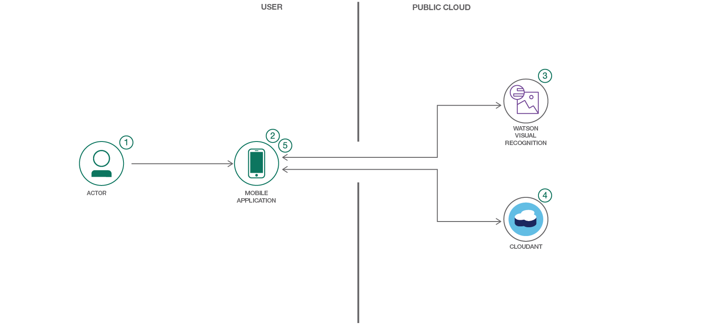
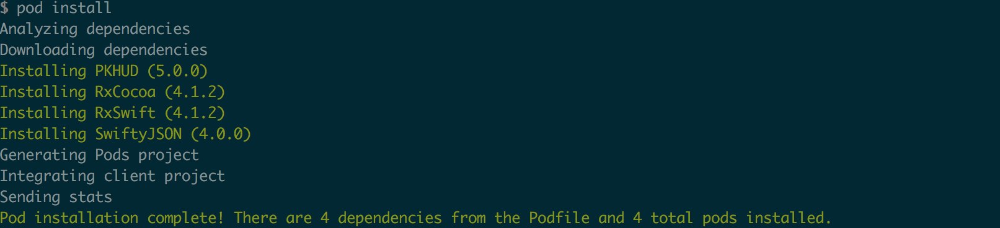
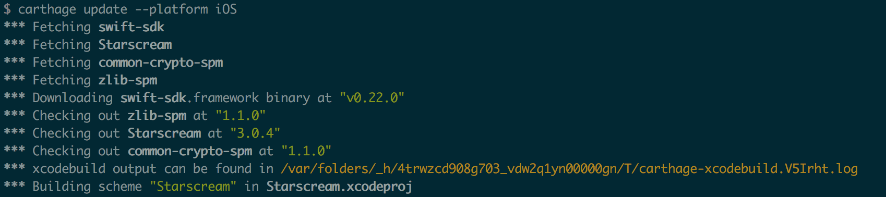
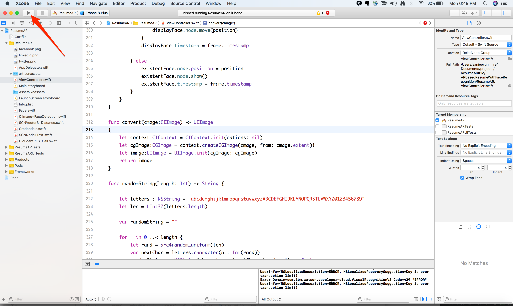

# Augmented Reality Résumé

IBM Cloud iOS Swift starter with Watson Visual Recognition and Core ML

[![IBM Cloud powered][img-ibmcloud-powered]][url-bluemix]
[](https://developer.apple.com/swift/)

[img-ibmcloud-powered]: https://img.shields.io/badge/IBM%20Cloud-powered-blue.svg
[url-bluemix]: http://bluemix.net

### Table of Contents
* [Summary](#summary)
* [Requirements](#requirements)
* [Configuration](#configuration)
* [Run](#run)
* [Resources](#resources)
* [License](#license)

### Summary

Combining iOS face recognition using Vision API, classification using IBM Visual Recognition, and person identification using classified image and data, one can build an app to search faces and identify them. One of the use cases is to build a Augmented Reality based résumé using visual recognition.

This iOS app recognizes the face and presents you with an AR view that displays a résumé of the person in the camera view. The app classifies a face with Watson Visual Recognition and Core ML. The images are classified offline using a deep neural network that is trained by Visual Recognition.

This application will do the following by default:

* Configure ARKit
* Use the iOS Vision module
* Leverage the Watson Swift SDK
* Classify images with [Watson Visual Recognition](https://www.ibm.com/watson/services/visual-recognition/) and [Core ML](https://developer.apple.com/machine-learning/)

### Requirements
* iOS 11.0+
* Xcode 9.3
* Swift 4.1
* iPhone 7, or greater, to leverage ARKit

### Components


1. User opens the app on their mobile
1. A face is detected using the iOS Vision module
1. An image of the face is sent to Watson Visual Recognition to be classified
1. Additional information about the person are retrieved from a Cloudant database based on the classification from Watson Visual Recognition
1. The information from the database is placed in front of the original person's face in the mobile camera view

#### Included Capabilities

* [ARKit](https://developer.apple.com/arkit/): ARKit is an augmented reality framework for iOS applications.
* [Watson Visual Recognition](https://www.ibm.com/watson/developercloud/visual-recognition.html): Visual Recognition understands the contents of images - visual concepts tag the image, find human faces, approximate age and gender, and find similar images in a collection.
* [Core ML](https://developer.apple.com/documentation/coreml): With Core ML, you can integrate trained machine learning models into your app.
* [Cloudant NoSQL DB](https://console.ng.bluemix.net/catalog/services/cloudant-nosql-db): A fully managed data layer designed for modern web and mobile applications that leverages a flexible JSON schema.

#### Technologies

* [Artificial Intelligence](https://medium.com/ibm-data-science-experience): Artificial intelligence can be applied to disparate solution spaces to deliver disruptive technologies.
* [Mobile](https://mobilefirstplatform.ibmcloud.com/): Systems of engagement are increasingly using mobile technology as the platform for delivery.

#### Watch the Video

[](https://youtu.be/M3WlymI1J9E)

### Configuration

1. Install CocoaPods using the following command:

```bash
$ sudo gem install cocoapods
```

2. If the CocoaPods repository is not configured, run the following command:

```bash
$ pod setup
```

3. At a command line, run `pod install` to install the dependencies.


If you run into any issues during the pod install, it is recommended to run a pod update by using the following commands:
```bash
$ pod update
$ pod install
```

4. Run `carthage bootstrap --platform iOS` to install the Watson related dependencies.


5. Once the previous steps are complete, open the Xcode workspace: `{APP_Name}.xcworkspace`. Run the application by clicking the `Build` and `Run` menu options, specifying the native iOS device on which you will be running the application.


#### Classification

When the app loads, the app will create 3 classifiers for each of the zip files [`ResumeAR/sanjeev.zip`](ResumeAR/sanjeev.zip), [`ResumeAR/steve.zip`](ResumeAR/steve.zip) and [`ResumeAR/scott.zip`](ResumeAR/scott.zip).
> To create a new classifier use the [Watson Visual Recognition tool](https://watson-visual-recognition.ng.bluemix.net/). A classifier will train the visual recognition service, it will be able to recognize different images of the same person. Use at least ten images of your head shot and also create a negative data set by using headshots that are not your own.

The app will also create an [IBM Cloudant NoSQL database](https://console.bluemix.net/catalog/services/cloudant-nosql-db) in the service instance referenced in the `BMSCredentials.plist` file. Each JSON document in this database represents **one** person. The JSON schema can be found in [`schema.json`](ResumeAR/schema.json). When the app loads, it will also create 3 documents for the 3 classification done in step 3.
> To create new documents in the same database, use the [`schema.json`](ResumeAR/schema.json) provided to fill out the details. Replace the `classificationId` in the schema with the `classificationId` you receive from the classifier once the Watson Visual Recognition model has been successfully trained. This ID will be used to retrieve details about the classified person.

**NOTE:** The training in Watson Visual Recognition might take couple of minutes. If the status is in `training`, then the AR will show `Training in progress` in your AR view. You can check the status of your classifier by using following curl command:

```
curl "https://gateway-a.watsonplatform.net/visual-recognition/api/v3/classifiers?api_key={API_KEY}&verbose=true&version=2016-05-20"
```

Replace the `API_KEY` with the Watson Visual Recognition api key, as found in your `BMSCredentials.plist` file.

### Run

1. To test the running application on the iPhone, you can use the test images provided in [`Test Images`](../images/TestImages) folder, which will yield the output shown below.

#### Sample Output

| | | |
|-|-|-|
|  |  |  |

#### Extending the application

To create a new classifier and database entry, perform the following steps:

1. Create a new Watson Visual Recognition classifier using the [online tool](https://watson-visual-recognition.ng.bluemix.net/) for each person you want to be able to identify, use at least ten images of that person.

2. Update the Cloudant database using the classifier ID from the previous step. To update the database perform a `POST` command like the following:

```
data='{"classificationId":"Watson_VR_Classifier_ID","fullname":"Joe Smith","linkedin":"jsmith","twitter":"jsmith","facebook":"jsmith","phone":"512-555-1234","location":"San Francisco"}'

curl -H "Content-Type: application/json" -X POST -d $data https://$ACCOUNT.cloudant.com/$DATABASE
```

> The `$ACCOUNT` variable is the URL which can be found in the credentials that you created when setting up Cloudant.

> The `$DATABASE` variable is the database name you created in IBM Cloudant.

> See [`ResumeAR/schema.json`](ResumeAR/schema.json) for additional information about the Cloudant database configuration.

3. Run the app and point the camera view to your newly classified image.

### Resources

* **Artificial Intelligence Code Patterns**: Enjoyed this Code Pattern? Check out our other [AI Code Patterns](https://developer.ibm.com/code/technologies/artificial-intelligence/).
* **AI and Data Code Pattern Playlist**: Bookmark our [playlist](https://www.youtube.com/playlist?list=PLzUbsvIyrNfknNewObx5N7uGZ5FKH0Fde) with all of our Code Pattern videos
* **With Watson**: Want to take your Watson app to the next level? Looking to utilize Watson Brand assets? [Join the With Watson program](https://www.ibm.com/watson/with-watson/) to leverage exclusive brand, marketing, and tech resources to amplify and accelerate your Watson embedded commercial solution.
* **Offline image classification using Watson Visual Recognition and Core ML** [Visual Recognition Example](https://github.com/watson-developer-cloud/visual-recognition-coreml)

#### Troubleshooting
* In order to start from scratch you need to delete the Watson Visual Recognition trained models, delete the data from the Cloudant database and delete the app to delete downloaded models.

#### Links

* [ARKit](https://developer.apple.com/arkit)
* [Watson Swift SDK](https://github.com/watson-developer-cloud/swift-sdk)
* [IBM Visual Recognition](https://www.ibm.com/watson/services/visual-recognition-4)
* [IBM Cloudant](https://www.ibm.com/cloud/cloudant)

### License

[Apache 2.0](LICENSE)
